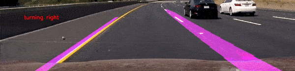

# Project - Lane Departure Warning System for an Autonomous Vehicle

* This project is an implementation of a Lane Departure Warning System
* The project is implemented Detects the Lanes on the road using the camera mounted to a vehicle
* The Project also predicts the turn to take along with the angle to turn.
* The data that is used dor this project is located at `data/project_video.mp4`

## Minimum Requirements
* Python 3.5
* Opencv 3.4.2 or above

## Execution
To execute the project run
* `python3 src/lane_detection.py`

## See how it works

<em>Lane Departure Warning System</em>

## Results
The results are discussed in the report `doc/Lane_detection.pdf`

